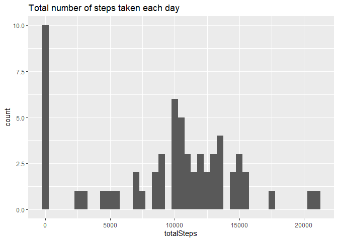
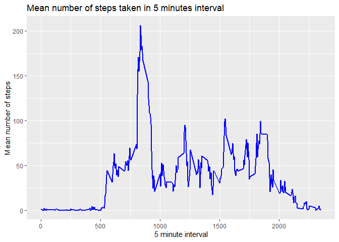
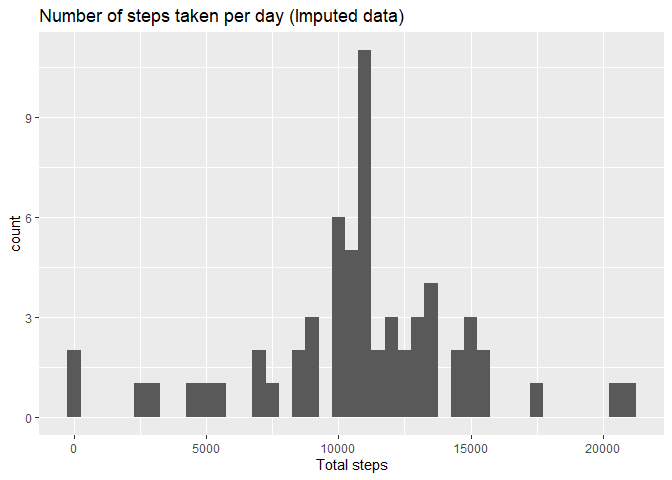
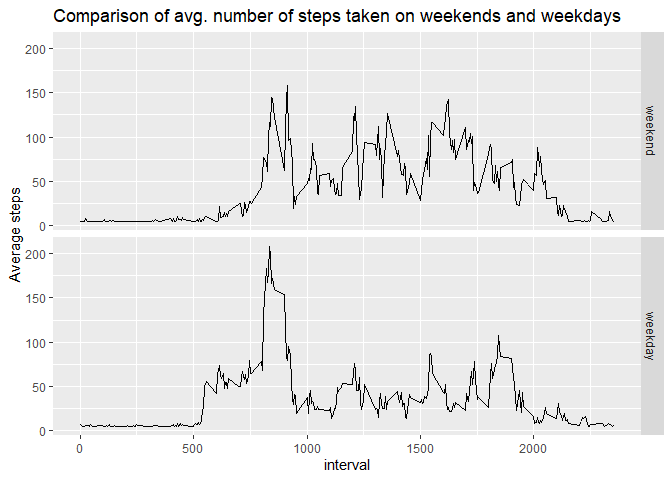

Loading and preprocessing the data
----------------------------------

    if(!file.exists('activity.csv')){
      unzip('activity.zip')
    }

    dfActivity <- read.csv('activity.csv')

Histogram of the total number of steps taken each day
-----------------------------------------------------

A new dataframe is created to count the number of steps on a particular
date. And then the same is plotted using ggplot library.

    dfActivity2 <- dfActivity %>%
      group_by(date) %>%
      summarise(totalSteps = sum(steps, na.rm = TRUE))

    ggplot(dfActivity2, aes(totalSteps)) +
      geom_histogram(binwidth = 500) +
      ggtitle("Total number of steps taken each day")

Mean and median number of steps taken each day
----------------------------------------------

    stepsMean <- mean(dfActivity2$totalSteps)
    stepsMedian <- median(dfActivity2$totalSteps)

    cat("Average steps taken: ", stepsMean)

    ## Average steps taken:  9354.23

    cat("median of steps taken: ", stepsMedian)

    ## median of steps taken:  10395

Time series plot of the average number of steps taken
-----------------------------------------------------

    dfActivity3 <- dfActivity %>%
      group_by(interval) %>%
      summarise(meanSteps = mean(steps, na.rm = TRUE))

    ggplot(dfActivity3, aes(interval, meanSteps)) +
      geom_line(color = "blue", size = 0.75) +
      ggtitle("Mean number of steps taken in 5 minutes interval") +
      xlab("5 minute interval") +
      ylab("Mean number of steps")

The 5-minute interval that, on average, contains the maximum number of steps
----------------------------------------------------------------------------

    maxAvgSteps <- which.max(dfActivity3$meanSteps)
    maxAvgBy5MinInterval <- dfActivity3[maxAvgSteps, 'interval']
    maxAvgBy5MinInterval <- gsub("([0-9]{1,2})([0-9]{2})", "\\1:\\2", maxAvgBy5MinInterval)
    cat("The 5-minute interval that, on average, contains the maximum number of steps: ", maxAvgBy5MinInterval)

    ## The 5-minute interval that, on average, contains the maximum number of steps:  8:35

strategy for imputing missing data
----------------------------------

The folowing startegy is used for imputing the missing data:

1.  The original datafrme is copied in another dataframe.

2.  A function is written which fills the NA fields with the mean of the
    present data.

3.  Then the column in the new dataframe is updated with the imputed
    data.

<!-- -->

    dfActivityImputed <- dfActivity
    imputeFunction <- function(x) {
      replace(x, is.na(x), mean(x, na.rm = TRUE))
    }

    dfActivityImputed$steps <- imputeFunction(dfActivity$steps)

    head(dfActivityImputed)

    ##     steps       date interval
    ## 1 37.3826 2012-10-01        0
    ## 2 37.3826 2012-10-01        5
    ## 3 37.3826 2012-10-01       10
    ## 4 37.3826 2012-10-01       15
    ## 5 37.3826 2012-10-01       20
    ## 6 37.3826 2012-10-01       25

Histogram of the total number of steps taken each day after missing values are imputed
--------------------------------------------------------------------------------------

    dfActivityImputedDailySteps <- dfActivityImputed %>%
      group_by(date) %>%
      summarise(totalSteps = sum(steps))

    ggplot(dfActivityImputedDailySteps, aes(totalSteps)) +
      geom_histogram(binwidth = 500) +
      ggtitle("Number of steps taken per day (Imputed data)") +
      xlab("Total steps")

Panel plot comparing the average number of steps taken per 5-minute interval across weekdays and weekends
---------------------------------------------------------------------------------------------------------

    dfActivityImputed$date <- as.Date(dfActivityImputed$date, '%Y-%m-%d')

    weekdays1 <- c('Monday', 'Tuesday', 'Wednesday', 'Thursday', 'Friday')
    dfActivityImputed$day <- factor((weekdays(dfActivityImputed$date) %in% weekdays1), 
                       levels=c(FALSE, TRUE), labels=c('weekend', 'weekday')) 

    dfWeekends <- dfActivityImputed %>%
      group_by(interval) %>%
      filter(day == 'weekend') %>%
      mutate(meanSteps = mean(steps, na.rm = TRUE))

    dfWeekdays <- dfActivityImputed %>%
      group_by(interval) %>%
      filter(day == 'weekday') %>%
      mutate(meanSteps = mean(steps, na.rm = TRUE))                   

    df_new <- rbind(dfWeekdays, dfWeekends)

    ggplot(df_new, aes(interval, meanSteps)) +
      geom_line() +
      facet_grid(day~.) +
      ggtitle("Comparison of avg. number of steps taken on weekends and weekdays") +
      ylab("Average steps")

